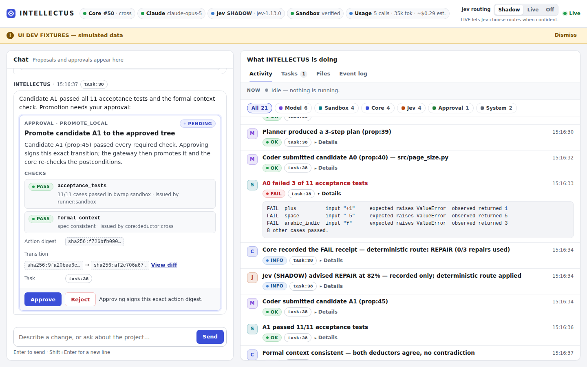

# INTELLECTUS

A supervised agent harness for software changes. You chat with it; it
proposes a precisely specified task with protected acceptance tests; after
you approve, Claude plans and writes the code, the code is executed in an
isolated sandbox against the tests, failures are routed (deterministic rules
first, optionally Jev), and nothing reaches your project until you approve
the exact change. Every step is recorded in an append-only, replayable log.

> The LLM proposes. Jev optionally recommends routing. The knowledge graph
> tracks justification. Trusted code checks and authorizes. The gateway
> executes. You approve.



| Component | Language | Directory |
|---|---|---|
| **The Substance**: the single writer of project state. An append-only SQLite event log with a pure reducer, replay, the axiomatic knowledge graph, policy, the verifier, admission and the outbox | Rust | [`core/`](core/) |
| **The Parallel Attributes**: the harness. Claude-backed Planner, Coder and Tester, the bubblewrap sandbox runner, the tool gateway, Jev routing, and the web UI and CLI | Go | [`engine/`](engine/) |
| **The Absolute Mathematical Deductor**: a bounded ground-Horn fixpoint that detects contradictions, cross-checked against a Rust reference | Mojo | [`deductor/`](deductor/) |

## Quick start

Requirements: Linux with unprivileged user namespaces, `bwrap` (bubblewrap
≥ 0.8), `prlimit` (util-linux), Python 3 under `/usr`, Rust, Go ≥ 1.24.
Mojo is optional; without it the core uses the Rust reference deductor.

```sh
(cd core && cargo build --release)
(cd engine && go build -o ../intellectus ./cmd/intellectus)
MOJO=/path/to/mojo deductor/build.sh          # optional

export ANTHROPIC_API_KEY=...                   # required: Claude runs the roles
export OPENROUTER_API_KEY=...                  # optional: Jev via OpenRouter (alpha access)
# or export TYPESAFE_API_KEY=...               # optional: Jev via TypeSafe directly

./intellectus doctor --project-dir ~/my-project
./intellectus up --project-dir ~/my-project    # init on first run, then serve
```

`up` prints a URL such as `http://127.0.0.1:7777/?token=…`. Open it to get the
chat and the live activity view. State lives in `~/my-project/.intellectus/`
(the database, operator key, chat log, and exports). Your working files are
never modified: approved results are exported to
`.intellectus/exports/<project>-<root>/` when you ask for it.

### How a task flows

1. **Chat.** You describe the change. Claude, acting as intake, either answers
   or proposes a task: a Python function (file and name), a precise
   requirement, and 6–20 acceptance tests (`returns` / `raises`).
2. **Approve the task.** Your click signs, with your Ed25519 operator key, the
   requirement, the protected test manifest, the spec premises and the task.
3. **Plan → code → test.** The Planner and Coder (Claude) produce a candidate.
   The core records it and the sandbox runs every test case in a fresh
   bubblewrap sandbox. The sandbox runs as an unprivileged uid, has no
   network, no host files and a scrubbed environment, and is bounded by CPU,
   memory, process, file-size and time limits. The core, not the runner, turns
   the observations into PASS/FAIL.
4. **Route failures.** Deterministic rules come first (budget exhausted,
   authority needed). When a real judgment call remains, Jev is asked for
   GATHER_CONTEXT / REPAIR / REPLAN / ESCALATE / STOP. In SHADOW mode (the
   default) its advice is recorded but not applied; in LIVE mode it is applied
   when confident. The Tester diagnoses, the Coder repairs, the Planner
   replans.
5. **Approve the change.** The approval card shows the checks and a diff.
   Your approval is bound to the exact action digest: the base root, the
   candidate root and the tool. The core promotes atomically, and a changed
   patch never reuses an old approval.
6. **Export** (optional, needs its own approval) writes the approved tree to
   the export directory through the tool gateway, with crash reconciliation.

## Status

**EXECUTED** means the code ran in this repository's automated tests or in a
live session. **VERIFIED** means a test asserted the required result.
Nothing here has been independently audited.

| Capability | Status | Evidence |
|---|---|---|
| Core: event log, reducer, replay, knowledge graph, admission, outbox, recovery (contract T01–T26 except T19) | VERIFIED | 34 Rust integration tests, 9 unit tests |
| Mojo deductor ≡ Rust reference | VERIFIED | 32 hand-derived vectors; 300 random differential cases; the core in `cross` mode |
| Real sandboxed execution (M4, contract T19) | VERIFIED on this host (as root) | 18 sandbox tests, including adversarial candidates (file, env, network, fork bomb, memory, spin, forged results); 13-probe self-test at every start |
| Claude integration (official Go SDK) | VERIFIED + EXECUTED live | Wire-format tests against a fake API; a live session with `claude-opus-5`: proposal, then plan, then code passing 16/16 sandboxed tests, then promotion |
| Jev client (TypeSafe and OpenRouter routes) | VERIFIED against a fake API; NOT executed live | Both endpoints are blocked by this build environment's network policy; the request shape comes from the MIT community harness `ismaelsoilet/jev-harness@37ab8c6` because TypeSafe's docs were unreachable |
| Harness end to end | VERIFIED | A real core, real sandbox and fake Claude/Jev servers run chat → proposal → approval → failing candidate → Jev LIVE routing → diagnosis → repair → PASS → approval → promotion → export → replay |
| Web UI and HTTP API | VERIFIED (auth/CSRF/CSP) + EXECUTED | Server security tests; Playwright run against fixtures; screenshots in `docs/screenshots/` |
| Comparison study B0/B1/B2 (contract §7) | NOT DONE | Needs live Jev access and a task suite with a budget |

### Limitations

* **Tests are evidence, not proof.** A candidate controls what it reports
  about its own behaviour and can special-case test inputs. See
  [`engine/sandbox/README.md`](engine/sandbox/README.md) for the full threat
  model.
* **No seccomp filter.** The kernel remains the main residual risk. The
  sandbox is Linux-only.
* **Narrow task scope.** A task is one Python function with JSON-encodable
  inputs and outputs. Other languages, and multi-function or CLI tasks, are
  not yet supported.
* **Formal checks are narrow.** They cover only the finite ground Horn
  fragment. For chat-created tasks that means "the approved tests never both
  accept and reject the same input".
* **Jev defaults to SHADOW,** as the contract requires, until thresholds are
  calibrated on held-out examples. LIVE is one click away in the UI (a signed
  policy change).
* **Append-only is not tamper-proof.** It holds within the application's trust
  model, not against someone who controls the host.
* **Concurrent tasks don't rebase.** When one promotion changes the approved
  root, other open candidates must be redone (they escalate with
  `BASE_ROOT_CHANGED`).

## Development

```sh
./scripts/check.sh    # Mojo build and conformance, Rust fmt/clippy/tests, Go vet and race tests, demo
```

* [`docs/ARCHITECTURE.md`](docs/ARCHITECTURE.md): how the contract maps onto
  the components, and every deviation from the contract.
* [`docs/PROTOCOL.md`](docs/PROTOCOL.md): the core wire protocol.
* [`docs/UI_API.md`](docs/UI_API.md): the UI's HTTP API.
